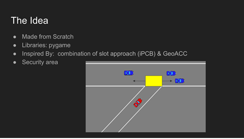
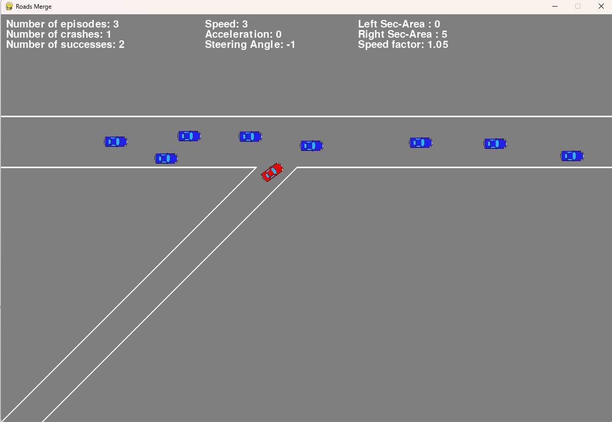

# Simulation-of-Autonomous-Road-Merging

## AFEKA - Tel-Aviv Academic College Of Engineering<br/>Department: Intelligent Systems<br/>Course: Autonomous Vehicle

---

**Course project:** Development of an autonomous road merging simulation with adaptive learning behavior.  
The simulation models autonomous vehicle merging from a secondary road into a main traffic road.

**Project Completion Date:** 2024  

**Development Tools:** Python, Pygame  

**Main Concepts:**  
Adaptive security area, autonomous merging logic, collision detection, state-machine based control, dynamic traffic simulation.

---

## Overview

The project was inspired by:
- adaptive cruise control systems,
- slot-based merging approaches,
- autonomous driving decision-making algorithms.

The simulation models:
- traffic vehicles with dynamic speeds,
- autonomous merging behavior,
- collision detection,
- adaptive security areas,
- environment state transitions,
- basic learning behavior based on previous collisions.

The ego vehicle performs merging using a finite-state logic:
- Start
- Slow Down
- Wait
- Turn
- Speed Up
- Regular Speed

The adaptive learning mechanism updates the security area near the merge point according to:
- collision direction,
- traffic speed,
- previous failures.

If collisions continue to occur, the security area increases dynamically in order to create safer merging behavior.

---

## Core Idea

The project is inspired by slot-based autonomous merging approaches such as iPCB and GeoACC.

The main idea is to create a dynamic security area near the merge point and allow the ego vehicle to enter the main road only when the area is considered safe.

The security area adapts according to:
- previous collisions,
- traffic speed,
- collision direction,
- environment behavior over time.

This creates a simple adaptive learning mechanism that improves merging behavior after failures.



---

## Simulation Screenshot



The simulation window displays:
- traffic vehicles on the main road,
- the ego vehicle entering from the secondary road,
- adaptive security area parameters,
- vehicle speed,
- steering angle,
- acceleration,
- statistics of successful and failed merging attempts.

---

## Main Features

- Autonomous merge decision making
- Dynamic traffic generation
- Collision detection
- Adaptive security area learning
- State-machine based vehicle control
- Traffic speed adaptation
- Visual simulation using Pygame

---

## Code Structure

### PlayerCar
- ResetPlayerCar
- CrashProcess
- Update

### Environment
- Get_start_slowdown_point
- Get_dist_till_merge
- Update
- If_allow_turn
- Update_coll_shifts
- Step

---

## Running the Project

Install dependencies:

```bash
pip install pygame
```

Run the simulation:

```bash
python roads_merge_simulation.py
```

---

## Notes

This project was developed as part of a group academic project.

The implementation and programming were primarily written by me.
